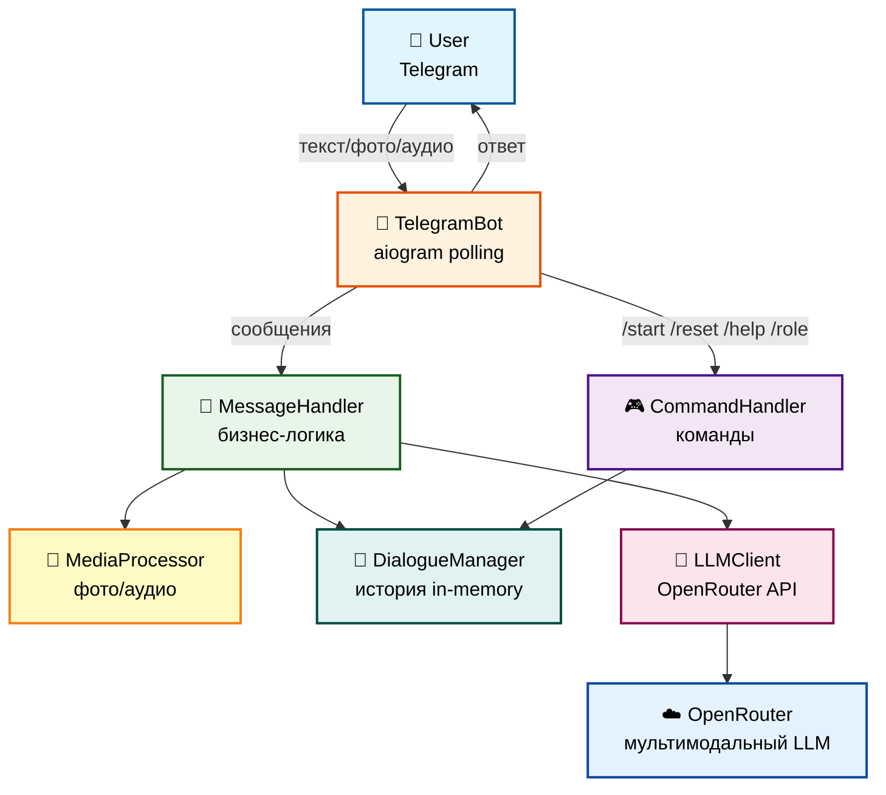
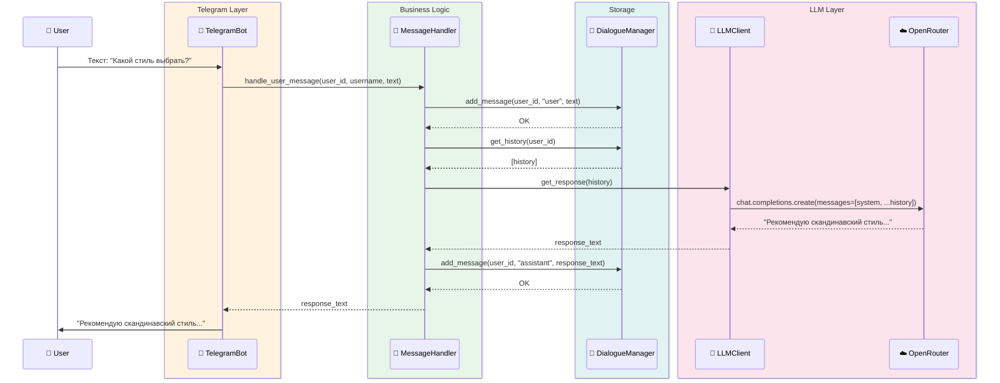
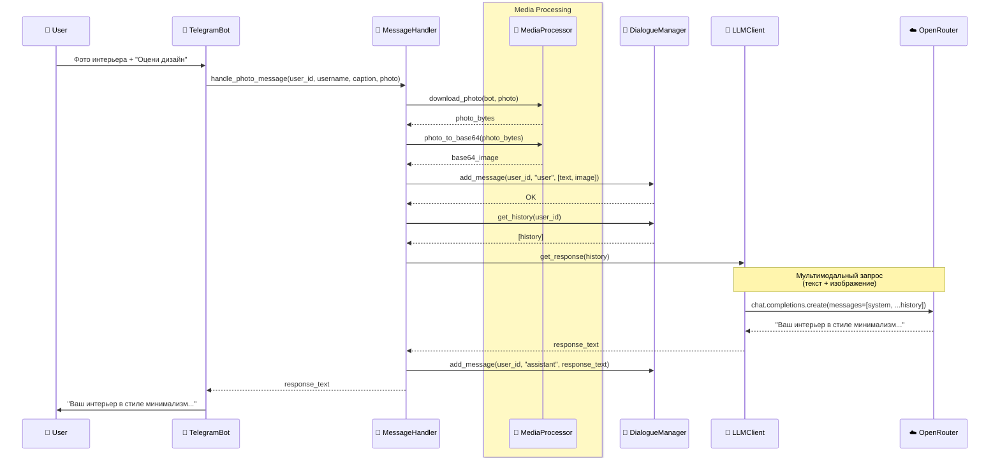
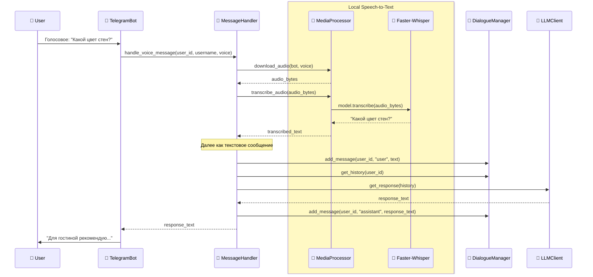

# Architecture Overview: Архитектура HomeGuru

Обзор архитектуры Telegram-бота HomeGuru - ИИ-дизайнера интерьеров.

---

## Высокоуровневая архитектура



---

## Основные компоненты

### 1. TelegramBot (инфраструктура)

**Роль:** Интеграция с Telegram Bot API

**Файл:** `src/bot/bot.py` (~60 строк)

**Ответственность:**
- Регистрация handlers для команд и сообщений
- Делегирование команд в `CommandHandler`
- Делегирование сообщений в `MessageHandler`
- Обработка ошибок на уровне транспорта
- Polling для получения обновлений

**Зависимости:**
- `MessageHandler` (Protocol не используется - конкретный класс)
- `CommandHandler` (Protocol не используется - конкретный класс)

---

### 2. MessageHandler (бизнес-логика)

**Роль:** Обработка пользовательских сообщений

**Файл:** `src/bot/message_handler.py` (~60 строк)

**Ответственность:**
- Обработка текстовых сообщений
- Обработка фотографий (через `MediaProvider`)
- Обработка голосовых (через `MediaProvider`)
- Координация: история + LLM + медиа
- Формирование ответа пользователю

**Зависимости:**
- `LLMProvider` (Protocol) - для получения ответов от LLM
- `DialogueStorage` (Protocol) - для управления историей
- `MediaProvider` (Protocol) - для обработки медиа

---

### 3. CommandHandler (команды)

**Роль:** Обработка команд бота

**Файл:** `src/bot/command_handler.py` (~45 строк)

**Ответственность:**
- `/start` - приветствие от HomeGuru
- `/role` - информация о специализации
- `/reset` - очистка истории диалога
- `/help` - справка о командах
- Генерация текстов ответов

**Зависимости:**
- `DialogueStorage` (Protocol) - для очистки истории

---

### 4. DialogueManager (хранение истории)

**Роль:** In-memory хранилище диалогов

**Файл:** `src/bot/dialogue_manager.py` (~50 строк)

**Ответственность:**
- Хранение истории: `dict[user_id, list[messages]]`
- Добавление сообщений (текстовых и мультимодальных)
- Получение истории для пользователя
- Очистка истории
- Ограничение размера истории (`MAX_HISTORY_MESSAGES`)

**Реализует:** `DialogueStorage` Protocol

**Особенности:**
- Данные в памяти (теряются при перезапуске)
- Изоляция по `user_id`
- Поддержка мультимодальных сообщений (текст + фото)

---

### 5. LLMClient (интеграция с LLM)

**Роль:** Работа с мультимодальными LLM

**Файл:** `src/bot/llm_client.py` (~45 строк)

**Ответственность:**
- Отправка запросов в OpenRouter API
- Добавление system prompt (роль HomeGuru)
- Поддержка мультимодальных сообщений (текст + изображения)
- Возврат ответа от LLM

**Реализует:** `LLMProvider` Protocol

**Технологии:**
- OpenAI client (с base_url на OpenRouter)
- Поддержка Vision API для анализа фотографий

---

### 6. MediaProcessor (обработка медиа)

**Роль:** Обработка фотографий и аудио

**Файл:** `src/bot/media_processor.py` (~85 строк)

**Ответственность:**
- Скачивание фотографий из Telegram
- Конвертация фото в base64 (для Vision API)
- Скачивание голосовых сообщений
- Транскрибация аудио через Faster-Whisper (локально)

**Реализует:** `MediaProvider` Protocol

**Технологии:**
- Faster-Whisper (base модель, CPU)
- Base64 encoding для изображений
- Temporary файлы для аудио

---

### 7. Config (конфигурация)

**Роль:** Загрузка настроек

**Файл:** `src/bot/config.py` (~50 строк)

**Ответственность:**
- Загрузка переменных из `.env`
- Загрузка system prompt из `system_prompt.txt`
- Валидация обязательных параметров
- Предоставление конфигурации всем модулям

**Настройки:**
- Telegram токен
- OpenRouter API ключ и модель
- Параметры диалогов (max_history)
- Параметры Whisper (модель, устройство)

---

### 8. Interfaces (Protocol контракты)

**Роль:** Определение абстракций (SOLID DIP)

**Файл:** `src/bot/interfaces.py` (~25 строк)

**Protocol интерфейсы:**

```python
class LLMProvider(Protocol):
    def get_response(self, messages: list[dict[str, Any]]) -> str: ...

class DialogueStorage(Protocol):
    def add_message(self, user_id: int, role: str, content: str | list[dict[str, Any]]) -> None: ...
    def get_history(self, user_id: int) -> list[dict[str, Any]]: ...
    def clear_history(self, user_id: int) -> None: ...

class MediaProvider(Protocol):
    async def download_photo(self, bot: Bot, photo: PhotoSize) -> bytes: ...
    def photo_to_base64(self, photo_bytes: bytes) -> str: ...
    async def download_audio(self, bot: Bot, voice: Voice) -> bytes: ...
    def transcribe_audio(self, audio_bytes: bytes) -> str: ...
```

---

## Поток обработки сообщений

### Текстовое сообщение



---

### Фотография



---

### Голосовое сообщение



---

## Применение SOLID принципов

### Single Responsibility Principle (SRP)

Каждый класс имеет одну четкую ответственность:

| Класс | Ответственность |
|-------|----------------|
| `TelegramBot` | Только Telegram инфраструктура |
| `MessageHandler` | Только бизнес-логика сообщений |
| `CommandHandler` | Только обработка команд |
| `DialogueManager` | Только хранение истории |
| `LLMClient` | Только работа с LLM API |
| `MediaProcessor` | Только обработка медиа-файлов |
| `Config` | Только загрузка конфигурации |

---

### Dependency Inversion Principle (DIP)

Зависимость от абстракций (Protocol), а не от реализаций:

```python
# MessageHandler зависит от Protocol, не от конкретных классов
class MessageHandler:
    def __init__(
        self,
        llm: LLMProvider,              # ← Protocol
        dialogue_storage: DialogueStorage,  # ← Protocol
        media_provider: MediaProvider   # ← Protocol
    ):
        self.llm = llm
        self.dialogue_storage = dialogue_storage
        self.media_provider = media_provider
```

**Преимущества:**
- ✅ Легко заменить реализацию (например, другой LLM provider)
- ✅ Легко тестировать (моки автоматически совместимы с Protocol)
- ✅ Слабая связанность между модулями

---

## MVP Constraints

### In-Memory Storage

**Текущая реализация:**
```python
class DialogueManager:
    def __init__(self):
        self.dialogues: dict[int, list[dict[str, Any]]] = {}
```

**Ограничения:**
- ❌ Данные теряются при перезапуске бота
- ❌ Не масштабируется на несколько инстансов
- ✅ Простота реализации (KISS)
- ✅ Быстрая работа (нет latency БД)

---

### Синхронная обработка

**Текущая реализация:**
- Один пользователь = один активный диалог
- Последовательная обработка сообщений от одного пользователя
- Нет очередей, нет параллельных запросов

**Ограничения:**
- ❌ Если LLM отвечает долго - пользователь ждет
- ✅ Простая логика (KISS)
- ✅ Нет проблем с race conditions

---

### Локальная транскрибация

**Текущая реализация:**
- Faster-Whisper base модель (~140MB)
- CPU обработка (не требует GPU)
- Локальное хранение модели

**Преимущества:**
- ✅ Нет зависимости от внешних API
- ✅ Нет дополнительных затрат
- ✅ Работает offline

**Ограничения:**
- ⚠️ Медленнее cloud-решений (но достаточно для MVP)
- ⚠️ Требует RAM (~500MB для base модели)

---

## Точки расширения

### Добавление нового LLM провайдера

1. Создай класс, реализующий `LLMProvider` Protocol
2. Добавь конфигурацию в `.env`
3. Обнови `main.py` для инициализации
4. Все остальное работает без изменений (DIP!)

Пример:
```python
# src/bot/anthropic_client.py
class AnthropicClient:
    def get_response(self, messages: list[dict[str, Any]]) -> str:
        # Реализация для Anthropic API
        ...

# src/bot/main.py
if config.llm_provider == "anthropic":
    llm_client = AnthropicClient(...)
else:
    llm_client = LLMClient(...)  # OpenRouter
```

---

### Добавление persistence

1. Создай класс, реализующий `DialogueStorage` Protocol
2. Например: `RedisDialogueManager` или `PostgresDialogueManager`
3. Обнови `main.py` для инициализации
4. Все остальное работает без изменений (DIP!)

Пример:
```python
# src/bot/redis_dialogue_manager.py
class RedisDialogueManager:
    def add_message(self, user_id: int, role: str, content: str | list) -> None:
        # Сохранение в Redis
        ...
    
    def get_history(self, user_id: int) -> list[dict[str, Any]]:
        # Загрузка из Redis
        ...
```

---

### Добавление новой команды

1. Добавь метод в `CommandHandler`
2. Зарегистрируй handler в `TelegramBot`
3. Добавь тесты

Пример:
```python
# src/bot/command_handler.py
def get_settings_message(self) -> str:
    return "Ваши настройки: ..."

# src/bot/bot.py
@self.dp.message(Command("settings"))
async def cmd_settings(message: Message):
    response = self.command_handler.get_settings_message()
    await message.answer(response)
```

---

## Архитектурные решения (ADR)

Ключевые решения задокументированы:

### ADR-01: Монолитная архитектура с мультимодальностью
- **Решение:** MVP-монолит вместо микросервисов
- **Обоснование:** Простота, быстрая разработка, достаточно для MVP
- **Файл:** `docs/addrs/ADR-01.md`

### ADR-02: Faster-Whisper для Speech-to-Text
- **Решение:** Локальная транскрибация вместо cloud API
- **Обоснование:** Нет зависимости от внешних сервисов, экономия
- **Файл:** `docs/addrs/ADR-02.md`

---

## Метрики архитектуры

### Качество кода

- ✅ **Test Coverage: 98%** (цель ≥80%)
- ✅ **Mypy strict: 0 errors**
- ✅ **Ruff: All checks passed**
- ✅ **Tests: 66 passed**

### Размер модулей

| Модуль | Строк кода | Сложность |
|--------|-----------|-----------|
| `main.py` | 88 | Простая |
| `bot.py` | ~60 | Простая |
| `message_handler.py` | ~60 | Средняя |
| `command_handler.py` | ~45 | Простая |
| `llm_client.py` | ~45 | Простая |
| `dialogue_manager.py` | ~50 | Простая |
| `media_processor.py` | ~85 | Средняя |
| `config.py` | ~50 | Простая |
| `interfaces.py` | ~25 | Простая |

**Итого:** ~520 строк основного кода

---

## Следующие шаги

После изучения архитектуры:

1. **Детальный тур по коду:** [`04-codebase-tour.md`](04-codebase-tour.md)
2. **Модель данных:** [`05-data-model.md`](05-data-model.md)
3. **Конфигурация:** [`07-configuration.md`](07-configuration.md)

---

## Дополнительные материалы

- **Техническое видение:** `docs/vision.md`
- **Соглашения разработки:** `docs/conventions.md`
- **Процесс работы:** `docs/workflow.md`
- **ADRs:** `docs/addrs/`

