# Visual System Overview: HomeGuru в диаграммах

Комплексная визуализация архитектуры HomeGuru с разных точек зрения.

---

## 1. System Context Diagram

Система в окружении - взаимодействие с внешним миром.

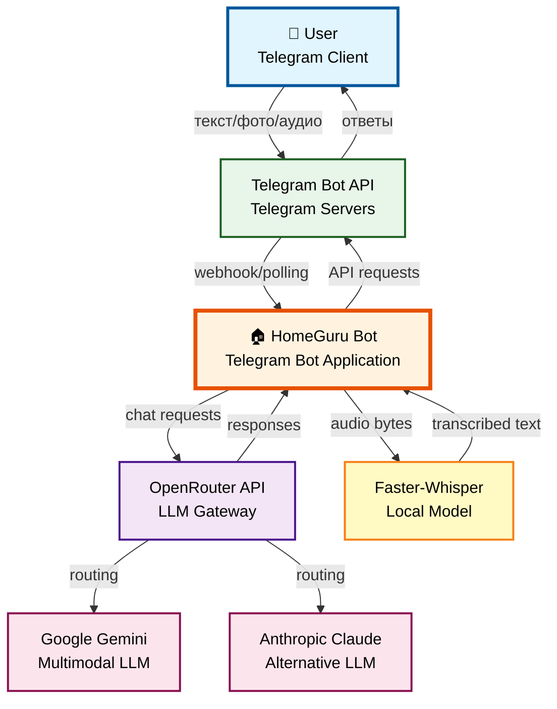

**Внешние зависимости:**
- **Telegram Bot API** - polling для получения обновлений
- **OpenRouter** - прокси для мультимодальных LLM
- **Faster-Whisper** - локальная модель (без внешних API)

---

## 2. Component Structure

Внутренняя структура приложения - компоненты и их связи.

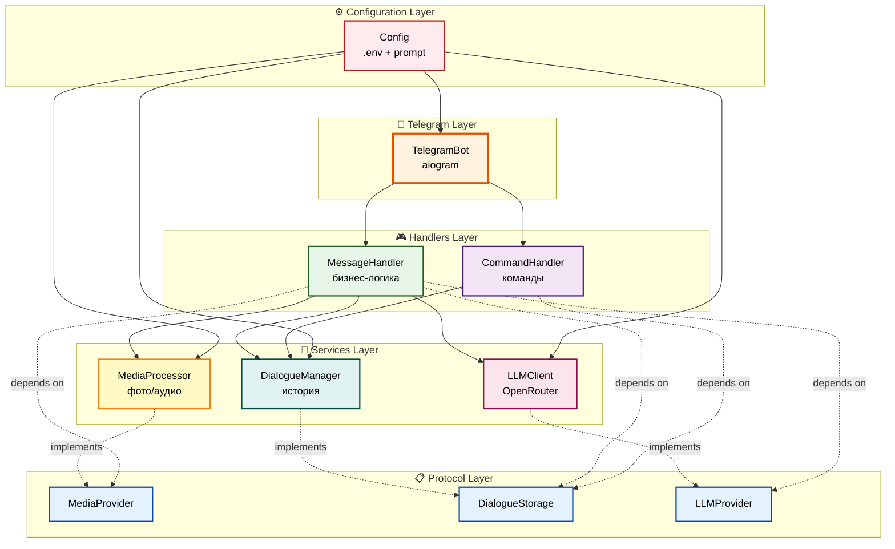

**Слои:**
- **Telegram Layer** - инфраструктура aiogram
- **Handlers Layer** - обработчики команд и сообщений
- **Services Layer** - бизнес-логика
- **Protocol Layer** - абстракции (SOLID DIP)
- **Configuration Layer** - настройки

---

## 3. Class Diagram

Основные классы и их отношения.

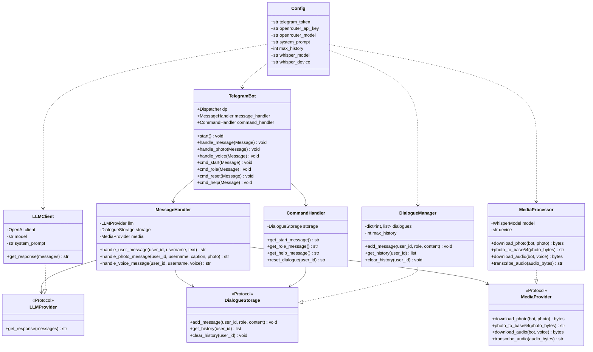

**Отношения:**
- `-->` композиция/агрегация
- `..>` использование (dependency)
- `..|>` реализация Protocol

---

## 4. Data Flow Diagram - Текстовое сообщение

Поток данных при обработке текста.

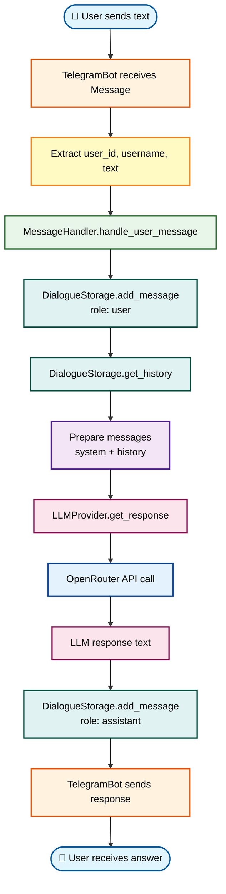

---

## 5. Data Flow Diagram - Фотография

Поток данных при обработке изображения.

```mermaid
flowchart TD
    Start([👤 User sends photo])
    Receive[TelegramBot receives Message]
    Extract[Extract user_id, username,<br/>caption, photo]
    Handle[MessageHandler.handle_photo_message]
    Download[MediaProvider.download_photo]
    Convert[MediaProvider.photo_to_base64]
    Format[Format multimodal message<br/>text + image_url]
    AddUser[DialogueStorage.add_message<br/>multimodal content]
    GetHist[DialogueStorage.get_history]
    PrepMsg[Prepare messages<br/>system + history + image]
    CallLLM[LLMProvider.get_response]
    VisionAPI[OpenRouter Vision API call]
    Response[LLM analyzes image<br/>+ returns text]
    AddAssist[DialogueStorage.add_message<br/>role: assistant]
    Send[TelegramBot sends response]
    End([👤 User receives analysis])
    
    Start --> Receive
    Receive --> Extract
    Extract --> Handle
    Handle --> Download
    Download --> Convert
    Convert --> Format
    Format --> AddUser
    AddUser --> GetHist
    GetHist --> PrepMsg
    PrepMsg --> CallLLM
    CallLLM --> VisionAPI
    VisionAPI --> Response
    Response --> AddAssist
    AddAssist --> Send
    Send --> End
    
    style Start fill:#e1f5ff,stroke:#01579b,stroke-width:2px,color:#000
    style Receive fill:#fff3e0,stroke:#e65100,stroke-width:2px,color:#000
    style Extract fill:#fff9c4,stroke:#f57f17,stroke-width:2px,color:#000
    style Handle fill:#e8f5e9,stroke:#1b5e20,stroke-width:2px,color:#000
    style Download fill:#fff9c4,stroke:#f57f17,stroke-width:2px,color:#000
    style Convert fill:#fff9c4,stroke:#f57f17,stroke-width:2px,color:#000
    style Format fill:#f3e5f5,stroke:#4a148c,stroke-width:2px,color:#000
    style AddUser fill:#e0f2f1,stroke:#004d40,stroke-width:2px,color:#000
    style GetHist fill:#e0f2f1,stroke:#004d40,stroke-width:2px,color:#000
    style PrepMsg fill:#f3e5f5,stroke:#4a148c,stroke-width:2px,color:#000
    style CallLLM fill:#fce4ec,stroke:#880e4f,stroke-width:2px,color:#000
    style VisionAPI fill:#e3f2fd,stroke:#0d47a1,stroke-width:2px,color:#000
    style Response fill:#fce4ec,stroke:#880e4f,stroke-width:2px,color:#000
    style AddAssist fill:#e0f2f1,stroke:#004d40,stroke-width:2px,color:#000
    style Send fill:#fff3e0,stroke:#e65100,stroke-width:2px,color:#000
    style End fill:#e1f5ff,stroke:#01579b,stroke-width:2px,color:#000
```

---

## 6. Data Flow Diagram - Голосовое сообщение

Поток данных при обработке аудио.

```mermaid
flowchart TD
    Start([👤 User sends voice])
    Receive[TelegramBot receives Message]
    Extract[Extract user_id, username, voice]
    Handle[MessageHandler.handle_voice_message]
    Download[MediaProvider.download_audio]
    Transcribe[MediaProvider.transcribe_audio<br/>Faster-Whisper]
    LocalModel[Local Whisper Model<br/>base, CPU]
    TextResult[Transcribed text]
    Continue[Continue as text message]
    AddUser[DialogueStorage.add_message<br/>role: user, text]
    GetHist[DialogueStorage.get_history]
    CallLLM[LLMProvider.get_response]
    Response[LLM response text]
    AddAssist[DialogueStorage.add_message<br/>role: assistant]
    Send[TelegramBot sends response]
    End([👤 User receives answer])
    
    Start --> Receive
    Receive --> Extract
    Extract --> Handle
    Handle --> Download
    Download --> Transcribe
    Transcribe --> LocalModel
    LocalModel --> TextResult
    TextResult --> Continue
    Continue --> AddUser
    AddUser --> GetHist
    GetHist --> CallLLM
    CallLLM --> Response
    Response --> AddAssist
    AddAssist --> Send
    Send --> End
    
    style Start fill:#e1f5ff,stroke:#01579b,stroke-width:2px,color:#000
    style Receive fill:#fff3e0,stroke:#e65100,stroke-width:2px,color:#000
    style Extract fill:#fff9c4,stroke:#f57f17,stroke-width:2px,color:#000
    style Handle fill:#e8f5e9,stroke:#1b5e20,stroke-width:2px,color:#000
    style Download fill:#fff9c4,stroke:#f57f17,stroke-width:2px,color:#000
    style Transcribe fill:#fff9c4,stroke:#f57f17,stroke-width:2px,color:#000
    style LocalModel fill:#fffde7,stroke:#f57f17,stroke-width:3px,color:#000
    style TextResult fill:#fff9c4,stroke:#f57f17,stroke-width:2px,color:#000
    style Continue fill:#f3e5f5,stroke:#4a148c,stroke-width:2px,color:#000
    style AddUser fill:#e0f2f1,stroke:#004d40,stroke-width:2px,color:#000
    style GetHist fill:#e0f2f1,stroke:#004d40,stroke-width:2px,color:#000
    style CallLLM fill:#fce4ec,stroke:#880e4f,stroke-width:2px,color:#000
    style Response fill:#fce4ec,stroke:#880e4f,stroke-width:2px,color:#000
    style AddAssist fill:#e0f2f1,stroke:#004d40,stroke-width:2px,color:#000
    style Send fill:#fff3e0,stroke:#e65100,stroke-width:2px,color:#000
    style End fill:#e1f5ff,stroke:#01579b,stroke-width:2px,color:#000
```

---

## 7. State Machine - Lifecycle диалога

Жизненный цикл диалога пользователя.

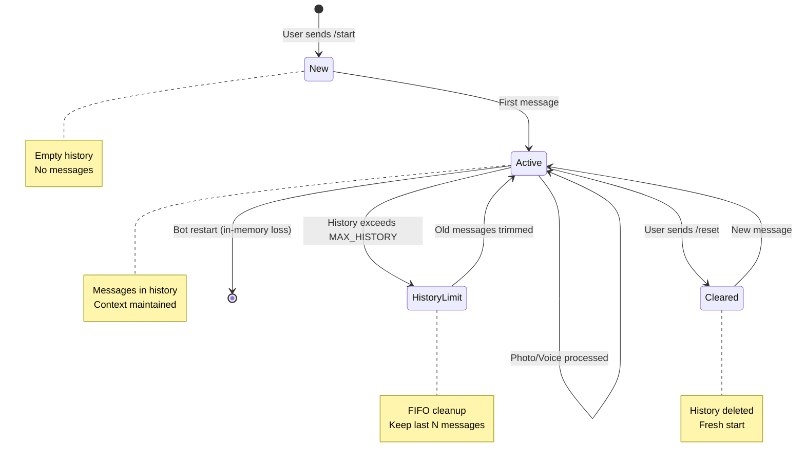

**Состояния:**
- **New** - пользователь только начал (/start)
- **Active** - активный диалог с историей
- **HistoryLimit** - превышен лимит, очистка старых сообщений
- **Cleared** - пользователь сбросил историю (/reset)

---

## 8. Deployment Diagram

Развертывание компонентов в runtime.

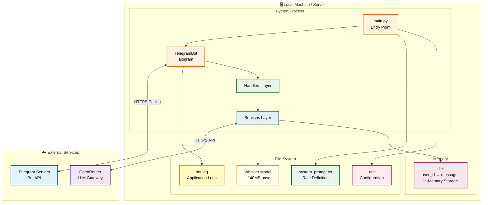

**Runtime компоненты:**
- **Python Process** - один процесс приложения
- **File System** - конфигурация и логи
- **Memory** - in-memory хранилище диалогов
- **External Services** - Telegram и OpenRouter

---

## 9. Module Dependencies

Зависимости между модулями (import graph).

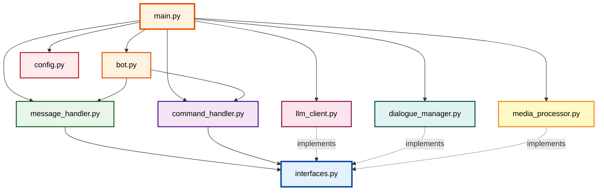

**Направление зависимостей:**
- `main.py` - точка входа, зависит от всех
- `interfaces.py` - не зависит ни от кого (контракты)
- Сервисы реализуют Protocol из `interfaces.py`
- Handlers зависят от Protocol, не от реализаций

---

## 10. Protocol Contracts (SOLID DIP)

Dependency Inversion через Protocol.

```mermaid
graph TB
    subgraph "High Level"
        MSG[MessageHandler<br/>бизнес-логика]
        CMD[CommandHandler<br/>команды]
    end
    
    subgraph "Abstractions (Protocol)"
        LP[LLMProvider<br/>Protocol]
        DS[DialogueStorage<br/>Protocol]
        MP[MediaProvider<br/>Protocol]
    end
    
    subgraph "Low Level"
        LLM[LLMClient<br/>OpenRouter]
        DLG[DialogueManager<br/>In-Memory]
        MEDIA[MediaProcessor<br/>Whisper]
    end
    
    subgraph "Alternative Implementations"
        LLM2[AnthropicClient<br/>Direct API]
        DLG2[RedisDialogueManager<br/>Persistent]
        MEDIA2[CloudMediaProcessor<br/>Cloud STT]
    end
    
    MSG -.depends on.-> LP
    MSG -.depends on.-> DS
    MSG -.depends on.-> MP
    CMD -.depends on.-> DS
    
    LLM -.implements.-> LP
    DLG -.implements.-> DS
    MEDIA -.implements.-> MP
    
    LLM2 -.can implement.-> LP
    DLG2 -.can implement.-> DS
    MEDIA2 -.can implement.-> MP
    
    style MSG fill:#e8f5e9,stroke:#1b5e20,stroke-width:3px,color:#000
    style CMD fill:#f3e5f5,stroke:#4a148c,stroke-width:3px,color:#000
    style LP fill:#e3f2fd,stroke:#0d47a1,stroke-width:3px,color:#000
    style DS fill:#e3f2fd,stroke:#0d47a1,stroke-width:3px,color:#000
    style MP fill:#e3f2fd,stroke:#0d47a1,stroke-width:3px,color:#000
    style LLM fill:#fce4ec,stroke:#880e4f,stroke-width:2px,color:#000
    style DLG fill:#e0f2f1,stroke:#004d40,stroke-width:2px,color:#000
    style MEDIA fill:#fff9c4,stroke:#f57f17,stroke-width:2px,color:#000
    style LLM2 fill:#ffebee,stroke:#880e4f,stroke-width:2px,color:#000,stroke-dasharray: 5 5
    style DLG2 fill:#ffebee,stroke:#004d40,stroke-width:2px,color:#000,stroke-dasharray: 5 5
    style MEDIA2 fill:#ffebee,stroke:#f57f17,stroke-width:2px,color:#000,stroke-dasharray: 5 5
```

**Преимущества DIP:**
- High-level modules зависят от абстракций
- Low-level реализации заменяемы
- Легко тестировать (моки Protocol)
- Легко расширять (новые реализации)

---

## 11. Data Structure - Message Format

Структура данных сообщений.

```mermaid
graph TB
    subgraph "Text Message"
        TM[Message Object]
        TM1[role: str]
        TM2[content: str]
        TM --> TM1
        TM --> TM2
    end
    
    subgraph "Multimodal Message (Photo)"
        MM[Message Object]
        MM1[role: str = 'user']
        MM2[content: list]
        MM21[TextPart]
        MM211[type: 'text']
        MM212[text: str]
        MM22[ImagePart]
        MM221[type: 'image_url']
        MM222[image_url]
        MM2221[url: str base64]
        
        MM --> MM1
        MM --> MM2
        MM2 --> MM21
        MM2 --> MM22
        MM21 --> MM211
        MM21 --> MM212
        MM22 --> MM221
        MM22 --> MM222
        MM222 --> MM2221
    end
    
    subgraph "History Structure"
        H[dialogues: dict]
        H1[user_id: int]
        H2[messages: list]
        H21[Message 1]
        H22[Message 2]
        H23[Message N]
        
        H --> H1
        H1 --> H2
        H2 --> H21
        H2 --> H22
        H2 --> H23
    end
    
    style TM fill:#e8f5e9,stroke:#1b5e20,stroke-width:2px,color:#000
    style TM1 fill:#c8e6c9,stroke:#1b5e20,stroke-width:1px,color:#000
    style TM2 fill:#c8e6c9,stroke:#1b5e20,stroke-width:1px,color:#000
    style MM fill:#e3f2fd,stroke:#0d47a1,stroke-width:2px,color:#000
    style MM1 fill:#bbdefb,stroke:#0d47a1,stroke-width:1px,color:#000
    style MM2 fill:#bbdefb,stroke:#0d47a1,stroke-width:1px,color:#000
    style MM21 fill:#90caf9,stroke:#0d47a1,stroke-width:1px,color:#000
    style MM211 fill:#64b5f6,stroke:#0d47a1,stroke-width:1px,color:#000
    style MM212 fill:#64b5f6,stroke:#0d47a1,stroke-width:1px,color:#000
    style MM22 fill:#90caf9,stroke:#0d47a1,stroke-width:1px,color:#000
    style MM221 fill:#64b5f6,stroke:#0d47a1,stroke-width:1px,color:#000
    style MM222 fill:#64b5f6,stroke:#0d47a1,stroke-width:1px,color:#000
    style MM2221 fill:#42a5f5,stroke:#0d47a1,stroke-width:1px,color:#000
    style H fill:#fce4ec,stroke:#880e4f,stroke-width:2px,color:#000
    style H1 fill:#f8bbd0,stroke:#880e4f,stroke-width:1px,color:#000
    style H2 fill:#f8bbd0,stroke:#880e4f,stroke-width:1px,color:#000
    style H21 fill:#f48fb1,stroke:#880e4f,stroke-width:1px,color:#000
    style H22 fill:#f48fb1,stroke:#880e4f,stroke-width:1px,color:#000
    style H23 fill:#f48fb1,stroke:#880e4f,stroke-width:1px,color:#000
```

---

## 12. Testing Architecture

Структура тестирования.

```mermaid
graph TB
    subgraph "Tests Layer"
        TC[Test Cases<br/>66 tests, 98% coverage]
        CF[conftest.py<br/>Fixtures]
    end
    
    subgraph "Fixtures"
        F1[dialogue_manager]
        F2[mock_llm_client]
        F3[mock_message]
        F4[mock_media_provider]
    end
    
    subgraph "Test Files"
        T1[test_bot.py]
        T2[test_message_handler.py]
        T3[test_command_handler.py]
        T4[test_dialogue_manager.py]
        T5[test_llm_client.py]
        T6[test_media_processor.py]
        T7[test_config.py]
        T8[test_main.py]
    end
    
    subgraph "Source Code"
        S1[bot.py]
        S2[message_handler.py]
        S3[command_handler.py]
        S4[dialogue_manager.py]
        S5[llm_client.py]
        S6[media_processor.py]
        S7[config.py]
        S8[main.py]
    end
    
    CF --> F1
    CF --> F2
    CF --> F3
    CF --> F4
    
    T1 --> F1
    T1 --> F2
    T1 --> F3
    T2 --> F1
    T2 --> F2
    T2 --> F4
    T3 --> F1
    T4 --> F1
    
    T1 -.tests.-> S1
    T2 -.tests.-> S2
    T3 -.tests.-> S3
    T4 -.tests.-> S4
    T5 -.tests.-> S5
    T6 -.tests.-> S6
    T7 -.tests.-> S7
    T8 -.tests.-> S8
    
    style TC fill:#e8f5e9,stroke:#1b5e20,stroke-width:3px,color:#000
    style CF fill:#fff9c4,stroke:#f57f17,stroke-width:2px,color:#000
    style F1 fill:#fff9c4,stroke:#f57f17,stroke-width:1px,color:#000
    style F2 fill:#fff9c4,stroke:#f57f17,stroke-width:1px,color:#000
    style F3 fill:#fff9c4,stroke:#f57f17,stroke-width:1px,color:#000
    style F4 fill:#fff9c4,stroke:#f57f17,stroke-width:1px,color:#000
```

---

## 13. Error Handling Flow

Обработка ошибок в системе.

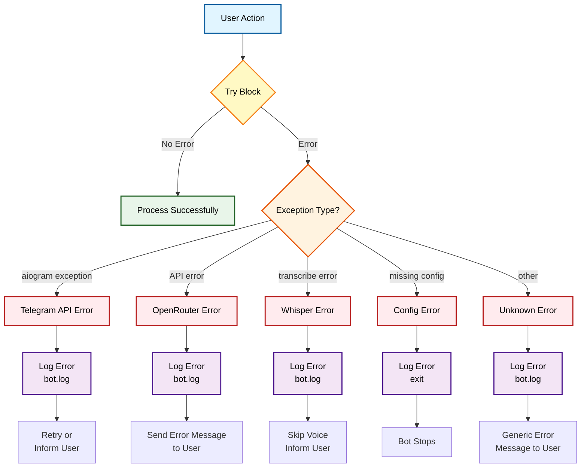

---

## Резюме по диаграммам

### Создано 13 диаграмм:

1. **System Context** - внешнее окружение
2. **Component Structure** - внутренние компоненты и слои
3. **Class Diagram** - классы и их отношения
4. **Data Flow (Text)** - обработка текста
5. **Data Flow (Photo)** - обработка фотографий
6. **Data Flow (Voice)** - обработка аудио
7. **State Machine** - жизненный цикл диалога
8. **Deployment** - runtime развертывание
9. **Module Dependencies** - зависимости между модулями
10. **Protocol Contracts** - SOLID DIP визуализация
11. **Data Structure** - форматы данных
12. **Testing Architecture** - структура тестов
13. **Error Handling** - обработка ошибок

### Типы диаграмм:
- 📊 **Структурные** - компоненты, классы, модули
- 🔄 **Поведенческие** - потоки данных, state machine
- 🚀 **Развертывания** - deployment, dependencies
- 🧪 **Тестирование** - test architecture
- ⚠️ **Обработка ошибок** - error flow

### Цветовая схема:
- **Оранжевый** - Telegram инфраструктура
- **Зеленый** - бизнес-логика, обработчики
- **Голубой** - Protocol абстракции, внешние API
- **Фиолетовый** - команды, конфигурация
- **Розовый** - LLM, хранилище
- **Желтый** - медиа-обработка
- **Красный** - конфигурация, ошибки

---

## Дополнительные материалы

- **Architecture Overview:** [`03-architecture-overview.md`](03-architecture-overview.md)
- **Developer Quickstart:** [`02-developer-quickstart.md`](02-developer-quickstart.md)
- **Configuration Guide:** [`07-configuration.md`](07-configuration.md)
- **Техническое видение:** `../vision.md`
- **ADRs:** `../addrs/`

