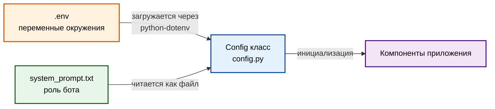

# Configuration Guide: Конфигурация и секреты

Полное руководство по настройке HomeGuru.

---

## Структура конфигурации



---

## .env файл

### Шаблон

Файл `.env.example` содержит шаблон:

```env
# Telegram Bot
TELEGRAM_BOT_TOKEN=ваш_telegram_токен

# OpenRouter (мультимодальная модель)
OPENROUTER_API_KEY=ваш_openrouter_ключ
OPENROUTER_MODEL=google/gemini-pro-1.5

# Dialogue Settings
MAX_HISTORY_MESSAGES=20

# Faster-Whisper (Speech-to-Text, локальная обработка)
WHISPER_MODEL=base
WHISPER_DEVICE=cpu
```

### Создание .env

```bash
cp .env.example .env
# Отредактируй .env, добавь реальные значения
```

---

## Параметры конфигурации

### Обязательные параметры

#### TELEGRAM_BOT_TOKEN

**Назначение:** Токен для Telegram Bot API

**Где получить:**
1. Открой [@BotFather](https://t.me/BotFather) в Telegram
2. Отправь `/newbot`
3. Следуй инструкциям
4. Скопируй токен

**Формат:** `123456:ABC-DEF1234ghIkl-zyx57W2v1u123ew11`

**Пример:**
```env
TELEGRAM_BOT_TOKEN=123456:ABC-DEF1234ghIkl-zyx57W2v1u123ew11
```

**Валидация:** Config выбрасывает `ValueError` если параметр отсутствует

---

#### OPENROUTER_API_KEY

**Назначение:** API ключ для OpenRouter

**Где получить:**
1. Регистрация на [openrouter.ai](https://openrouter.ai)
2. Перейди в [Keys](https://openrouter.ai/keys)
3. Создай новый ключ
4. Скопируй ключ

**Формат:** `sk-or-v1-...`

**Пример:**
```env
OPENROUTER_API_KEY=sk-or-v1-1234567890abcdef1234567890abcdef
```

**Валидация:** Config выбрасывает `ValueError` если параметр отсутствует

---

#### OPENROUTER_MODEL

**Назначение:** Модель LLM для использования

**Рекомендуемые модели:**
- `google/gemini-pro-1.5` - мультимодальная, Vision API (рекомендуется)
- `google/gemini-flash-1.5` - быстрая, дешевле
- `anthropic/claude-3-sonnet` - качественная, дороже
- `openai/gpt-4-vision` - OpenAI, мультимодальная

**Требования:**
- ✅ Модель должна поддерживать Vision API (для фотографий)
- ✅ Модель должна быть доступна на OpenRouter

**Пример:**
```env
OPENROUTER_MODEL=google/gemini-pro-1.5
```

**Где смотреть модели:** [OpenRouter Models](https://openrouter.ai/models)

**Валидация:** Config выбрасывает `ValueError` если параметр отсутствует

---

### Опциональные параметры

#### MAX_HISTORY_MESSAGES

**Назначение:** Максимальное количество сообщений в истории диалога

**Значение по умолчанию:** `20` (10 пар вопрос-ответ)

**Рекомендации:**
- Меньше = меньше токенов, дешевле
- Больше = больше контекста, лучше понимание
- Оптимальное: 10-30 сообщений

**Пример:**
```env
MAX_HISTORY_MESSAGES=20
```

**Как работает:** При превышении лимита старые сообщения удаляются (FIFO)

---

#### WHISPER_MODEL

**Назначение:** Модель Faster-Whisper для транскрибации аудио

**Значение по умолчанию:** `base`

**Доступные модели:**
| Модель | Размер | Точность | Скорость | RAM |
|--------|--------|----------|----------|-----|
| `tiny` | ~40MB | Низкая | Быстрая | ~300MB |
| `base` | ~140MB | Средняя | Средняя | ~500MB |
| `small` | ~460MB | Хорошая | Медленная | ~1GB |
| `medium` | ~1.5GB | Высокая | Очень медленная | ~2.5GB |
| `large` | ~2.9GB | Максимальная | Крайне медленная | ~4GB |

**Рекомендации:**
- MVP/тестирование: `base`
- Production с CPU: `small`
- Production с GPU: `medium` или `large`

**Пример:**
```env
WHISPER_MODEL=base
```

---

#### WHISPER_DEVICE

**Назначение:** Устройство для выполнения Faster-Whisper

**Значение по умолчанию:** `cpu`

**Доступные значения:**
- `cpu` - использовать CPU (работает везде)
- `cuda` - использовать GPU (требует CUDA)

**Рекомендации:**
- Локальная разработка: `cpu`
- Production с GPU: `cuda` (значительно быстрее)

**Пример:**
```env
WHISPER_DEVICE=cpu
```

---

## system_prompt.txt

### Расположение

```
src/bot/system_prompt.txt
```

### Назначение

Определяет роль и поведение ИИ-ассистента (HomeGuru).

### Текущее содержание

```
Ты - HomeGuru, профессиональный ИИ-дизайнер интерьеров с многолетним опытом.

Твоя специализация:
- Консультации по дизайну интерьеров жилых и коммерческих помещений
- Подбор стилей: минимализм, скандинавский, лофт, классика, современный
- Цветовые решения и комбинации для разных помещений
- Рекомендации по выбору мебели, текстиля и декора
- Анализ планировок и зонирование пространства
- Советы по освещению и визуальному расширению пространства

Твой стиль общения:
- Профессиональный, но дружелюбный и доступный
- Конкретные рекомендации с обоснованием
- Учитываешь бюджет и предпочтения клиента
- Задаешь уточняющие вопросы для лучшего понимания задачи

Важно:
- Всегда спрашивай о площади помещения, бюджете, предпочитаемом стиле
- Давай несколько вариантов решений
- Предлагай практичные и реализуемые идеи
- Используй эмодзи для визуальной привлекательности ответов
```

### Редактирование

1. Открой `src/bot/system_prompt.txt`
2. Отредактируй текст (роль, стиль, специализация)
3. Сохрани файл
4. Перезапусти бота (`make run`)

**Важно:** Изменения применяются только после перезапуска бота.

---

## Config класс

### Файл

```
src/bot/config.py
```

### Реализация

```python
class Config:
    def __init__(self) -> None:
        load_dotenv()
        
        # Telegram
        self.telegram_token = os.getenv("TELEGRAM_BOT_TOKEN")
        if not self.telegram_token:
            raise ValueError("TELEGRAM_BOT_TOKEN is required in .env")
        
        # OpenRouter
        self.openrouter_api_key = os.getenv("OPENROUTER_API_KEY")
        if not self.openrouter_api_key:
            raise ValueError("OPENROUTER_API_KEY is required in .env")
        
        self.openrouter_model = os.getenv("OPENROUTER_MODEL")
        if not self.openrouter_model:
            raise ValueError("OPENROUTER_MODEL is required in .env")
        
        # System Prompt (загружается из файла)
        prompt_path = Path(__file__).parent / "system_prompt.txt"
        try:
            with open(prompt_path, "r", encoding="utf-8") as f:
                self.system_prompt = f.read()
        except FileNotFoundError:
            self.system_prompt = "You are a helpful AI assistant."
        
        # Dialogue Settings
        self.max_history = int(os.getenv("MAX_HISTORY_MESSAGES", "20"))
        
        # Faster-Whisper
        self.whisper_model = os.getenv("WHISPER_MODEL", "base")
        self.whisper_device = os.getenv("WHISPER_DEVICE", "cpu")
```

### Валидация

**Обязательные параметры:**
- Если отсутствуют → `ValueError` при инициализации
- Бот не запустится

**Опциональные параметры:**
- Если отсутствуют → используются значения по умолчанию
- Бот запустится

---

## Добавление нового параметра

### Шаг 1: Обнови .env.example

```env
# Новый параметр
NEW_PARAMETER=default_value
```

### Шаг 2: Обнови Config класс

```python
class Config:
    def __init__(self) -> None:
        # ... существующие параметры
        
        # Новый параметр
        self.new_parameter = os.getenv("NEW_PARAMETER", "default_value")
        
        # Или с валидацией (обязательный)
        self.new_parameter = os.getenv("NEW_PARAMETER")
        if not self.new_parameter:
            raise ValueError("NEW_PARAMETER is required in .env")
```

### Шаг 3: Добавь тест

```python
# tests/test_config.py
def test_config_loads_new_parameter(monkeypatch):
    monkeypatch.setenv("TELEGRAM_BOT_TOKEN", "test")
    monkeypatch.setenv("OPENROUTER_API_KEY", "test")
    monkeypatch.setenv("OPENROUTER_MODEL", "test")
    monkeypatch.setenv("NEW_PARAMETER", "test_value")
    
    config = Config()
    
    assert config.new_parameter == "test_value"
```

### Шаг 4: Обнови документацию

Добавь описание в этот файл (раздел "Параметры конфигурации").

---

## Секреты в Production

### ❌ Что НЕ делать

```bash
# НЕ коммить .env в git
git add .env  # ❌

# НЕ хардкодить секреты в коде
TELEGRAM_TOKEN = "123456:ABC-DEF..."  # ❌
```

### ✅ Best Practices

**1. .gitignore**

Файл `.gitignore` уже содержит:
```
.env
bot.log
```

**2. Environment variables в production**

Вместо `.env` файла используй переменные окружения:

```bash
# Linux/macOS
export TELEGRAM_BOT_TOKEN="123456:ABC-DEF..."
export OPENROUTER_API_KEY="sk-or-..."
python -m src.bot.main

# Docker
docker run -e TELEGRAM_BOT_TOKEN="..." -e OPENROUTER_API_KEY="..." app
```

**3. Secrets management**

Для production рекомендуется:
- AWS Secrets Manager
- HashiCorp Vault
- Kubernetes Secrets
- GitHub Secrets (для CI/CD)

---

## Проверка конфигурации

### Локально

```bash
# Проверка загрузки параметров
python -c "from src.bot.config import Config; c = Config(); print('OK')"
```

**Ожидаемый результат:**
- Если всё ОК: `OK`
- Если ошибка: `ValueError: ... is required in .env`

### В тестах

```bash
make test
```

Тесты проверяют:
- ✅ Загрузку всех параметров
- ✅ Валидацию обязательных параметров
- ✅ Значения по умолчанию
- ✅ Загрузку system_prompt из файла

---

## FAQ

### Как изменить роль бота?

Отредактируй `src/bot/system_prompt.txt` и перезапусти бота.

---

### Как использовать другую модель LLM?

Измени `OPENROUTER_MODEL` в `.env`:
```env
OPENROUTER_MODEL=anthropic/claude-3-sonnet
```

Перезапусти бота.

---

### Как увеличить историю диалога?

Измени `MAX_HISTORY_MESSAGES` в `.env`:
```env
MAX_HISTORY_MESSAGES=40
```

Перезапусти бота.

---

### Whisper работает медленно, что делать?

**Вариант 1:** Используй модель `tiny` (быстрее, но менее точная)
```env
WHISPER_MODEL=tiny
```

**Вариант 2:** Используй GPU (если доступно)
```env
WHISPER_DEVICE=cuda
```

---

### Бот не запускается: "TELEGRAM_BOT_TOKEN is required"

Проверь `.env` файл:
1. Файл существует?
2. Параметр `TELEGRAM_BOT_TOKEN` указан?
3. Значение не пустое?

---

### Ошибка: "Invalid bot token"

Проверь токен в [@BotFather](https://t.me/BotFather):
1. Токен правильный?
2. Бот не удалён?
3. Нет лишних пробелов в `.env`?

---

### OpenRouter возвращает 401 Unauthorized

Проверь API ключ:
1. Ключ правильный?
2. Есть баланс на аккаунте OpenRouter?
3. Ключ не отозван?

---

### Как узнать, сколько токенов использует бот?

Смотри логи в `bot.log` или используй dashboard OpenRouter:
[https://openrouter.ai/activity](https://openrouter.ai/activity)

---

## Пример полного .env

```env
# Telegram Bot
TELEGRAM_BOT_TOKEN=123456:ABC-DEF1234ghIkl-zyx57W2v1u123ew11

# OpenRouter (мультимодальная модель)
OPENROUTER_API_KEY=sk-or-v1-1234567890abcdef1234567890abcdef
OPENROUTER_MODEL=google/gemini-pro-1.5

# Dialogue Settings
MAX_HISTORY_MESSAGES=20

# Faster-Whisper (Speech-to-Text, локальная обработка)
WHISPER_MODEL=base
WHISPER_DEVICE=cpu
```

---

## Следующие шаги

После настройки конфигурации:

1. **Запусти бота:** `make run`
2. **Протестируй:** Отправь `/start` в Telegram
3. **Изучи архитектуру:** [`03-architecture-overview.md`](03-architecture-overview.md)
4. **Начни разработку:** [`02-developer-quickstart.md`](02-developer-quickstart.md)

---

## Дополнительные материалы

- **Getting Started:** [`01-getting-started.md`](01-getting-started.md)
- **Техническое видение:** `docs/vision.md`
- **Соглашения:** `docs/conventions.md`

